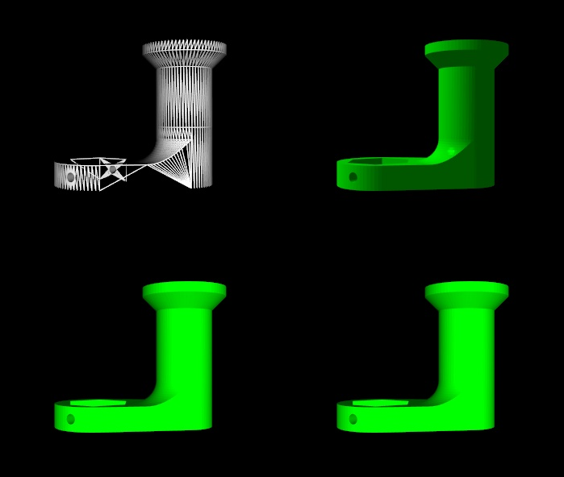

# Assignment 1 - README

## MM 804 GRAPHICS AND ANIMATION

---

### About

Render 3d object using VTK in following representation

1. Wireframe
1. Surface Flat Shading
1. Surface Gouraud Shading
1. Surface Phong Shading

Refer Assignment1.pdf for more details on the question

### Output

The 3d object has a total of 3180 vertices with each vertice having 3 co-ordinates x,y,z and the size of the file is 211kb.

### Development Environment

- Python - 3.10.0
- VTK - 9.1.0
- OS - Windows 11

Object and texture files used to rendered - Handle.obj and Handle.stl

### How to run

1. Open file assignment1.py
2. Run the file using python3

`python3 allShades.py `
